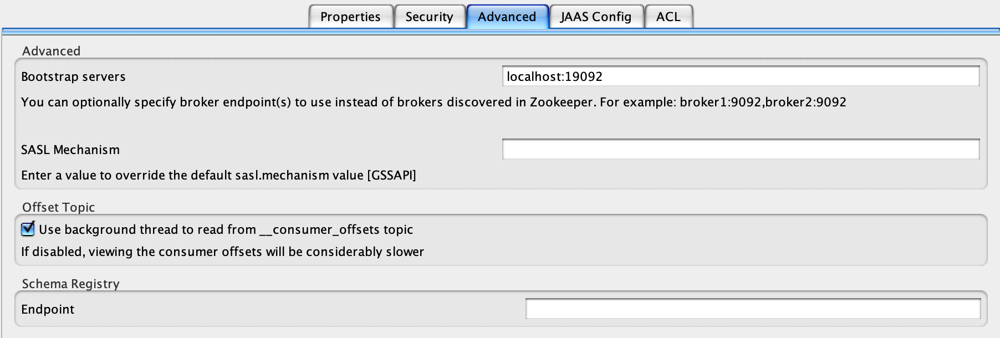
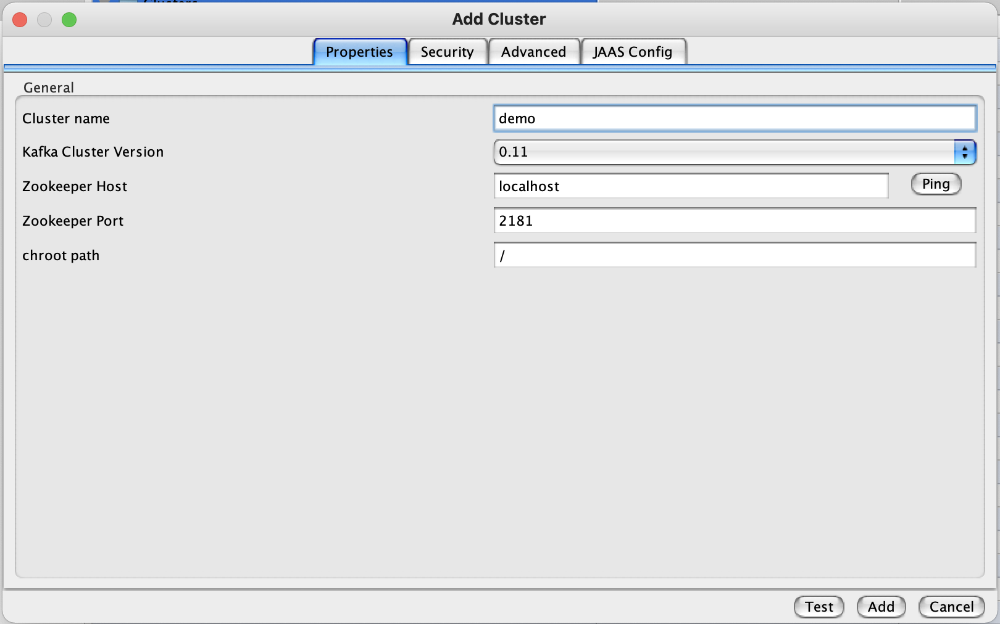
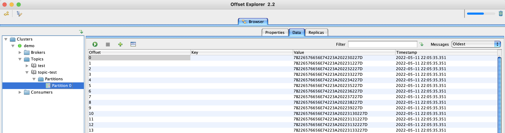

# KSELK

**K**afka - **S**park - **EL**asticsearch - **K**ibana

Sandbox to play with Big Data.


## How to run / simulate
## Prerequisite
Docker
## Steps
1. On the terminal ONE
```sh
virtualenv venv
source venv/bin/activate
pip install -r test/requirements.txt
sh start.sh
sh test/submit_sparkjob_py.sh
```
2. On the terminal TWO
```sh
source venv/bin/activate
python test/produce_data.py
```
3. On the terminal TWO
```sh
CTRL-C
```
4. Open Kibana and set as index pattern ***demo-***
```sh
http://127.0.0.1:5601/
```
5. Play around in Kibana (Discovery tab) to check it is populated.
6. On the terminal ONE or TWO
```sh
sh stop.sh
```

### What just happened?

You just run in docker 
- Kafka 2.11
- Spark (with Jupyter Notebook) 2.4.5 (Scala 2.11.12 and relative PySpark) 
- Elasticsearch 6.00
- Kibana 6.0.0

Then you subimitted
- an interactive spark job written in Python that consumes Kafka records and store into ES.
- a script to send sample records to Kafka.

On Kibana you set the index used by elastic search and finally you stopped all the processes.

## Useful links
- Jupiter notebook: ``` docker logs kselk_spark_1 | grep 127.0.0.1 | tail -1 ```
- Spark: [http://127.0.0.1:4040/](http://127.0.0.1:4040/) (not working)
- Elasticsearch: [http://127.0.0.1:9200/](http://127.0.0.1:9200/)
- Kibana: [http://127.0.0.1:5601/](http://127.0.0.1:5601/)

## Troubleshooting
### Validate script fails
if you are running on a MAC OSX try
```sh
screen ~/Library/Containers/com.docker.docker/Data/vms/0/tty
sysctl -w vm.max_map_count=262144
CTRL a d
```

### Monitor via Kafka tool
Install https://www.kafkatool.com/download.html
and configure as following


then open the partition 0 and press GREEN PLAY button


### Sumbitting the spark job
*py4j.protocol.Py4JJavaError: An error occurred while calling o54.start.
: org.elasticsearch.hadoop.EsHadoopIllegalArgumentException: Cannot resolve ip for hostname: elasticsearch*

```sh
Go to Docker Desktop app > Preferences > Resources > Advanced and increase the MEMORY - best to double it.
```


