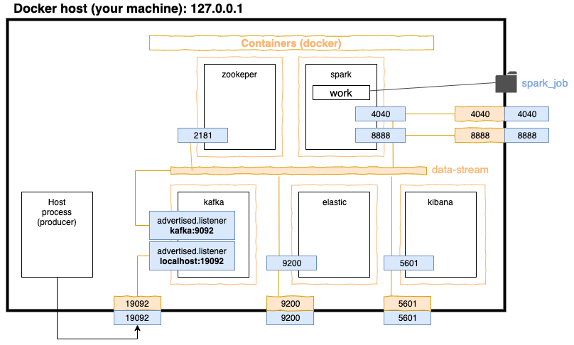

# KSELK

**K**afka - **S**park - **EL**asticsearch - **K**ibana



## How to run / simulate
On the terminal ONE
```sh
sh start
sh test/submit_sparkjob_py.sh
```
On the terminal TWO
```sh
python test/produce_data.py
```
Wait and have a look to the oputput and both terminals.
Open Kibana and set as index pattern ***demo-***
```sh
http://127.0.0.1:5601/
```
Play around in Kibana (Discovery tab) to check it is populated.

On the terminal TWO
```sh
CTRL-C
```
On the terminal ONE or TWO
```sh
sh stop.sh
```

### What happened?

You just run in docker 
- Kafka 2.11
- Spark (with Jupyter Notebook) 2.4.5 (Scala 2.11.12 and relative PySpark) 
- Elasticsearch 6.00
- Kibana 6.0.0

Then you subimitted
- an interactive spark job written in Python that consumes Kafka records and store into ES.
- a script to send sample records to Kafka.

## Usefull link
- Jupiter notebook: ``` docker logs kselk_spark_1 | grep 127.0.0.1 | tail -1 ```
- Spark: [http://127.0.0.1:4040/](http://127.0.0.1:4040/) (not working)
- Elasticsearch: [http://127.0.0.1:9200/](http://127.0.0.1:9200/)
- Kibana: [http://127.0.0.1:5601/](http://127.0.0.1:5601/)